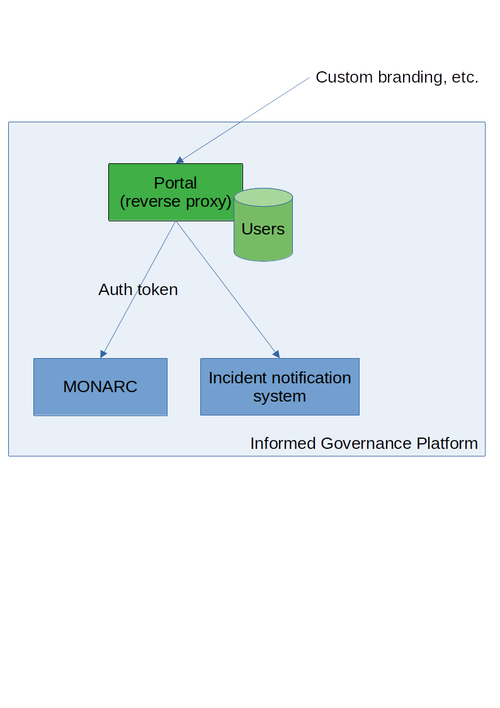

# SERIMA Architecture

## Overview

The main components are the following:

- a [portal](features/portal.md);
- a [MONARC](monarc.md) instance;
- incident notification system (MISP).

The portal provides a way to manage users (standard users directory of simple
custom one).

## Global Features to cover

The SERIMA platform should offer following functionalities to its users:

- **Security objectives**: the user assesses the performances of his organization
  for the listed security objectives.
- **Dependencies**: the user lists the operators his organization depends on.
- **Risk Management**: the user assesses the risks his organization faces.
- **Data submission**: the user can submit data (e.g. security objectives;
  dependencies; risk assessment) to his regulator / competent authority
- **Monitoring for users**: the user has the possibility to display on graphics,
  data he has captured.
- **Monitoring** for regulators/competent authority: the regulator/competent authority
  has the possibility to display on graphics:
  - Data submitted by each of his users.
  - Data submitted by a group of his users (e.g. health sector statistics).
- **Incident notification**: each user has the possibility to report incidents to
  his regulator / competent authority.
- **Regulator** / competent authority functionalities:
  - Submitted data management: each regulator/ competent authority can manage and
   process data submitted by his users.
- **User management**: each regulator/ competent authority should have the
   possibility to manage his users.
- **Platform configuration**: each regulator/ competent authority can configure
   his platform (e.g. branding; import sectoral library; configure users; export data; etc.).

### Summary table

|    Features                                                        |  Component           | Already exist         | Changes required | Cost estimation  |
|--------------------------------------------------------------------|----------------------|-----------------------|------------------|------------------|
| [Security objectives](features/objective.md)                       | MONARC               | YES (Referentials)    | content          |                  |
| [Dependencies](features/dependencies.md)                           | MONARC               | NO                    | creation         |                  |
| [Risk Management](features/risk.md)                                | MONARC               | YES (evaluation)      | content          |                  |
| [Data submission](features/data.md)                                | MONARC               | YES (import/Export)   | ---              |                  |
| [Monitoring for users](features/monitoring-users.md)               | MONARC               | partially (dashboard) |                  |                  |
| [Monitoring for regulators](features/monitoring-regulators.md)     | MONARC               | partially (dashboard) |                  |                  |
| [Regulator](features/regulator.md)                                 | MONARC               | temp by MONARC (BO/FO)|                  |                  |
| [Users management](features/users-management.md)                   | Portal / MONARC      | Partially MONARC      | single sign on   |                  |
| [Platform configuration](features/platform-configuration.md)       | Portal               | NO                    | Logo & colour    |                  |
| Incident notification                                              | MISP (not 100% sure) | temp. by existing     |                  |      NA          |

